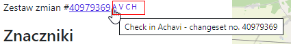

# violentmonkey_scripts
Scripts for violentmonkey browsers plugin
* #### [OSM Deep History integration v.MM](scripts/OSM_Deep_History_integration_v.MM)
add links for node, ways and relations
* d = `https://osmlab.github.io/osm-deep-history/#/${type}/${id}`
* p = `https://pewu.github.io/osm-history/#/${type}/${id}`
* m = `https://osm.mapki.com/history/${type}/${id}`
* v = `https://aleung.github.io/osm-visual-history/#/${type}/${id}`

* #### [OSM Deep History integration v.MM](scripts/OSM_Deep_History_integration_v.MM)
add links for node, ways and relations
* A = `https://overpass-api.de/achavi/?changeset=${id}`
* V = `https://resultmaps.neis-one.org/osm-change-viz?c=${id}`
* C = `https://osmcha.org/changesets/${id}`
* H = `https://osmhv.openstreetmap.de/changeset.jsp?id=${id}`

